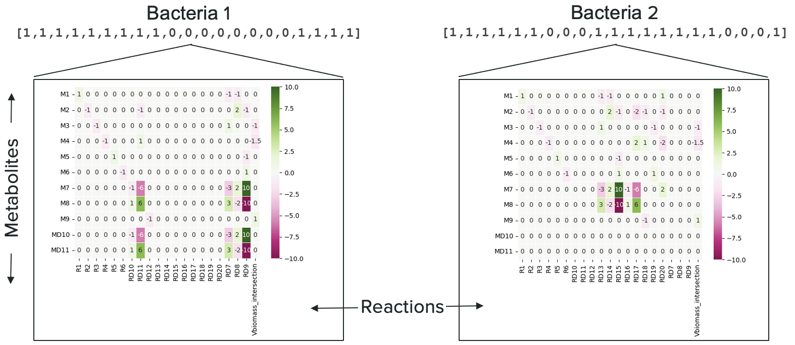

# Modeling the Evolution of Metabolic Networks Using a Genetic Algorithm

  

The objective was to investigate whether it's possible to find an evolutionary pathway between two different organisms with distinct metabolites and reactions using a Genetic algorithm.

In this project, we aim to use evolutionary algorithms, such as the genetic algorithm, to explore the genetic connections between different organisms, specifically bacteria. The objective is to trace a viable evolutionary path from one bacterium, for example, E. coli, to another, such as Salmonella. This objective is based on the understanding that all organisms are related by genetic lineage, and our goal is to map out a feasible route of evolution between them.

The basic strategy involves employing the concept of the Stoichiometric matrix to represent the metabolic network of an organism. This matrix is crucial because it encodes the reactions within the organism's metabolism, providing a map of its biochemical functions. To go from a starting organism to a target organism, we initiate with a population of stoichiometric matrices that represent the metabolic network of the starting organism. Importantly, the dimensionality of these matrices is determined by the union of the metabolic capabilities of both the starting and target organisms, ensuring that any potential evolutionary pathway can be accommodated within this framework.

The selection of organisms for this analysis is based on their shared metabolites, underlying the feasibility of metabolic transitions. The evolutionary path from the starting organism to the target is conceptualized as a series of steps, each representing a shift to an existing organism or a viable metabolic network, ultimately resulting in the target organism.

To navigate through this evolutionary process we need to account for many aspects. This includes determining appropriate rates of recombination and mutation, which dictate the genetic variation within our population. Moreover, defining a fitness function is essential to guide the Evolution. In this context, Flux Balance Analysis (FBA) could be somehow used as the fitness function, evaluating the metabolic efficiency of each hypothetical step in the evolutionary pathway.

The main challenge lies in effectively manipulating the stoichiometric matrix and applying evolutionary principles to iteratively refine our population towards the target organism. Through this process, we aim to uncover a feasible evolutionary path that not only illuminates the genetic relationship between the starting and target bacteria but also contributes to our understanding of bacterial evolution and metabolic diversity.

